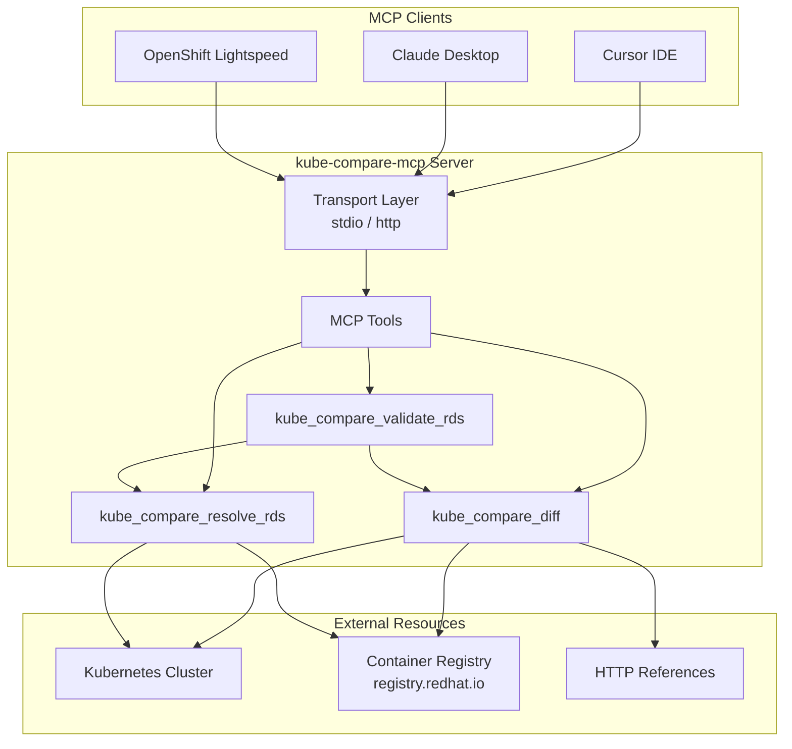

# kube-compare-mcp

MCP server for [kube-compare](https://github.com/openshift/kube-compare) - enables AI assistants to compare Kubernetes cluster configurations against reference templates.

## Table of Contents

- [Overview](#overview)
- [Architecture](#architecture)
- [Quick Start](#quick-start)
- [Installation](#installation)
- [Running the Server](#running-the-server)
- [Deployment](#deployment)
- [MCP Tools Reference](#mcp-tools-reference)
  - [kube_compare_diff](#kube_compare_diff)
  - [kube_compare_resolve_rds](#kube_compare_resolve_rds)
  - [kube_compare_validate_rds](#kube_compare_validate_rds)
- [RDS Support](#rds-reference-design-specification-support)
- [Connecting to Remote Clusters](#connecting-to-remote-clusters)
- [Reference Configuration Formats](#reference-configuration-formats)
- [Output Formats](#output-formats)
- [Configuration](#configuration)
- [Development](#development)
- [Related Projects](#related-projects)
- [License](#license)

## Overview

This project provides a [Model Context Protocol (MCP)](https://modelcontextprotocol.io/) server that exposes the `kube-compare` tool functionality. It allows AI assistants like Claude, Cursor, OpenShift Lightspeed (OLS), and other MCP-compatible clients to:

- Compare live Kubernetes cluster configurations against reference templates
- Detect configuration drift from known-good baselines
- Generate structured comparison reports in JSON, YAML, or JUnit formats
- **Automatically discover and use Red Hat Telco Reference Design Specifications (RDS)**

**Note:** This server is designed for remote deployment (e.g., in a Kubernetes cluster). Reference configurations must be provided via HTTP/HTTPS URLs or OCI container image references - local filesystem paths are not supported.

## Architecture



## Quick Start

```bash
# Build the server
git clone https://github.com/sakhoury/kube-compare-mcp.git
cd kube-compare-mcp
make build

# Run locally with stdio transport (for local MCP clients)
./bin/kube-compare-mcp

# Or run with HTTP transport for network access
./bin/kube-compare-mcp --transport=http --port=8080
```

## Installation

### Build from source

```bash
git clone https://github.com/sakhoury/kube-compare-mcp.git
cd kube-compare-mcp
make build
```

The binary will be available at `bin/kube-compare-mcp`.

### Install to system path

```bash
sudo make install
```

### Build for specific platforms

```bash
# macOS Apple Silicon
make build-darwin-arm64

# macOS Intel
make build-darwin-amd64

# Linux x86_64 (for containers/servers)
make build-linux-amd64

# All platforms
make build-all
```

## Running the Server

### CLI Options

| Flag | Description | Default |
|------|-------------|---------|
| `--transport` | Transport mode: `stdio` or `http` | `stdio` |
| `--port` | Port to listen on (for `http` transport) | `8080` |
| `--log-level` | Log level: `debug`, `info`, `warn`, `error` | `info` |
| `--log-format` | Log format: `text`, `json` | `text` |
| `--version` | Show version information | - |

### Transport Modes

#### stdio (default)

For local MCP clients like Cursor and Claude Desktop running on the same machine:

```bash
./bin/kube-compare-mcp --transport=stdio
```

#### HTTP (Streamable HTTP)

For network access and MCP client integration (Cursor, Claude Desktop, OpenShift Lightspeed):

```bash
./bin/kube-compare-mcp --transport=http --port=8080
```

Endpoints:
- `POST /mcp` - MCP endpoint
- `GET /health` - Health check endpoint

## Deployment

### Kubernetes / OpenShift

The recommended deployment is as a service in your Kubernetes cluster. This allows the MCP server to use in-cluster authentication and directly access the cluster API.

Deploy using the provided Kustomize manifests:

```bash
kubectl apply -k deploy/
```

This creates:
- A Deployment running the MCP server with HTTP transport
- A Service exposing the MCP server
- A Route (OpenShift) for external access
- RBAC resources for cluster read access

### Quick Deploy (Build, Push, Deploy, and Configure)

Build the container image, push to registry, deploy to OpenShift, and configure registry credentials in one command:

```bash
make docker-build docker-push deploy setup-registry-credentials IMG=quay.io/myuser/kube-compare-mcp:latest
```

### Registry Credentials (Required for RDS)

If using the RDS tools (`kube_compare_resolve_rds` or `kube_compare_validate_rds`), you need to provide credentials for `registry.redhat.io`.

**On OpenShift (recommended):** Use the Makefile target to copy the existing cluster pull-secret:

```bash
make setup-registry-credentials
```

**Alternatively**, create credentials from username/password:

```bash
kubectl create secret docker-registry registry-credentials \
  --docker-server=registry.redhat.io \
  --docker-username=<your-username> \
  --docker-password=<your-password> \
  -n kube-compare-mcp
```

Or use a local pull-secret file:

```bash
kubectl create secret generic registry-credentials \
  --from-file=.dockerconfigjson=/path/to/pull-secret.json \
  --type=kubernetes.io/dockerconfigjson \
  -n kube-compare-mcp
```

### OpenShift Lightspeed (OLS) Integration

To configure OpenShift Lightspeed to use this MCP server, add the following to your OLSConfig:

```yaml
spec:
  featureGates:
    - MCPServer
  mcpServers:
    - name: kube-compare-mcp
      streamableHTTP:
        url: http://kube-compare-mcp.kube-compare-mcp.svc.cluster.local:8080/mcp
        timeout: 60
        sseReadTimeout: 0
        enableSSE: false
```

### Configuration for MCP Clients

Configure your MCP client to connect to the server's endpoint:

**Cursor** (`.cursor/mcp.json`):

```json
{
  "mcpServers": {
    "kube-compare": {
      "url": "https://kube-compare-mcp-route.apps.your-cluster.example.com/mcp"
    }
  }
}
```

**Claude Desktop**:

```json
{
  "mcpServers": {
    "kube-compare": {
      "url": "https://kube-compare-mcp-route.apps.your-cluster.example.com/mcp"
    }
  }
}
```

**Local stdio mode** (Claude Desktop `claude_desktop_config.json`):

```json
{
  "mcpServers": {
    "kube-compare": {
      "command": "/path/to/kube-compare-mcp",
      "args": ["--transport=stdio"]
    }
  }
}
```

## MCP Tools Reference

The server exposes three MCP tools:

### kube_compare_diff

Detect configuration drift between a Kubernetes/OpenShift cluster and a reference design.

| Parameter | Type | Required | Description |
|-----------|------|----------|-------------|
| `reference` | string | Yes | URL to the reference configuration `metadata.yaml` file. Supports HTTP/HTTPS URLs or container image references (`container://image:tag:/path/to/metadata.yaml`). |
| `output_format` | string | No | Output format: `json`, `yaml`, or `junit`. Default: `json`. |
| `all_resources` | boolean | No | Compare all resources of types mentioned in the reference. Default: `false`. |
| `kubeconfig` | string | No | Kubeconfig content for connecting to a remote cluster (raw YAML or base64-encoded, auto-detected). If not provided, uses in-cluster config or KUBECONFIG env. |
| `context` | string | No | Kubernetes context name to use from the provided kubeconfig. Only applicable when `kubeconfig` is provided. |

**Example prompts:**

```
Compare my Kubernetes cluster against the reference configuration at https://example.com/telco-core/metadata.yaml
```

```
Run kube-compare on my cluster using reference container://quay.io/openshift-kni/telco-core-rds-rhel9:v4.18:/metadata.yaml
```

### kube_compare_resolve_rds

Get the correct Red Hat Telco RDS container reference for a cluster's OpenShift version.

| Parameter | Type | Required | Description |
|-----------|------|----------|-------------|
| `rds_type` | string | Yes | RDS type: `core` for Telco Core RDS or `ran` for Telco RAN DU RDS. |
| `ocp_version` | string | No | Explicit OpenShift version (e.g., `4.18`, `4.20.0`). If not provided, auto-detects from cluster. |
| `kubeconfig` | string | No | Kubeconfig content (raw YAML or base64-encoded, auto-detected). If not provided and `ocp_version` is not set, uses in-cluster config. |
| `context` | string | No | Kubernetes context name to use from the provided kubeconfig. |

**Response:**

```json
{
  "cluster_version": "4.18.0",
  "rhel_version": "rhel9",
  "rds_type": "core",
  "reference": "container://registry.redhat.io/openshift4/openshift-telco-core-rds-rhel9:v4.18:/usr/share/telco-core-rds/configuration/reference-crs-kube-compare/metadata.yaml",
  "available_versions": ["v4.16", "v4.17", "v4.18", "v4.19"],
  "validated": true
}
```

**Example prompts:**

```
Find the Telco Core RDS reference for my OpenShift 4.18 cluster
```

```
What RDS reference should I use for a RAN deployment on OpenShift 4.20?
```

### kube_compare_validate_rds

Validate an OpenShift cluster's compliance with Red Hat Telco RDS. This is the recommended tool for RDS validation.

| Parameter | Type | Required | Description |
|-----------|------|----------|-------------|
| `rds_type` | string | Yes | RDS type: `core` for Telco Core RDS or `ran` for Telco RAN DU RDS. |
| `output_format` | string | No | Output format: `json`, `yaml`, or `junit`. Default: `json`. |
| `all_resources` | boolean | No | Compare all resources of types mentioned in the reference. Default: `false`. |
| `kubeconfig` | string | No | Kubeconfig content (raw YAML or base64-encoded, auto-detected). If not provided, uses in-cluster config. |
| `context` | string | No | Kubernetes context name to use from the provided kubeconfig. |

**Response:**

```json
{
  "rds_reference": {
    "cluster_version": "4.18.0",
    "rhel_version": "rhel9",
    "rds_type": "core",
    "reference": "container://...",
    "available_versions": ["v4.16", "v4.17", "v4.18"],
    "validated": true
  },
  "comparison": {
    "Summary": { ... },
    "Diffs": [ ... ]
  }
}
```

**Example prompts:**

```
Compare my cluster against the Telco Core RDS
```

```
Check if my OpenShift cluster is compliant with the Telco RAN DU reference design
```

## RDS (Reference Design Specification) Support

This server includes specialized support for Red Hat's Telco Reference Design Specifications:

### Telco Core RDS (`core`)

For telco core network functions on OpenShift.

- **Image**: `registry.redhat.io/openshift4/openshift-telco-core-rds-rhel9`
- **RHEL Variants**: rhel9 (preferred), rhel8

### Telco RAN DU RDS (`ran`)

For Radio Access Network Distributed Unit workloads.

- **Image**: `registry.redhat.io/openshift4/ztp-site-generate-rhel8`
- **RHEL Variants**: rhel8 only

### Automatic Version Detection

When running inside an OpenShift cluster, the `kube_compare_resolve_rds` and `kube_compare_validate_rds` tools can automatically:

1. Detect the cluster's OpenShift version from the `ClusterVersion` resource
2. Find the matching RDS container image for that version
3. Select the best RHEL variant available (preferring newer versions)
4. Validate the image is accessible before returning

## Connecting to Remote Clusters

All tools support connecting to remote clusters via kubeconfig. The format is auto-detected:
- **Raw YAML**: Paste your kubeconfig content directly
- **Base64-encoded**: Traditional encoded format

### Using raw YAML kubeconfig

Simply provide the kubeconfig content as-is:

```json
{
  "reference": "https://example.com/metadata.yaml",
  "kubeconfig": "apiVersion: v1\nkind: Config\nclusters:\n- name: my-cluster\n  ...",
  "context": "my-cluster-context"
}
```

### Using base64-encoded kubeconfig

```bash
# Encode your kubeconfig
base64 < ~/.kube/config    # Works on both Linux and macOS
```

```json
{
  "reference": "https://example.com/metadata.yaml",
  "kubeconfig": "<base64-encoded-kubeconfig>",
  "context": "my-cluster-context"
}
```

### Minimal Kubeconfig for OLS

When using this MCP server with OpenShift Lightspeed (OLS), you may encounter token and file size limits. The OLS operator restricts the amount of data it sends to MCP servers. Since full kubeconfigs often contain embedded CA certificates and multiple contexts, they can exceed these limits.

Create a minimal kubeconfig using a service account token:

```bash
# Create a service account with cluster-admin access
oc create sa rds-checker -n default
oc adm policy add-cluster-role-to-user cluster-admin -z rds-checker -n default

# Generate a token and get the API server URL
TOKEN=$(oc create token rds-checker -n default --duration=24h)
API_SERVER=$(oc whoami --show-server)

# Create minimal kubeconfig
cat << EOF > minimal-kubeconfig.yaml
apiVersion: v1
kind: Config
clusters:
- cluster:
    server: ${API_SERVER}
    insecure-skip-tls-verify: true
  name: cluster
contexts:
- context:
    cluster: cluster
    user: user
  name: ctx
current-context: ctx
users:
- name: user
  user:
    token: ${TOKEN}
EOF

# Verify connectivity
export KUBECONFIG="${PWD}/minimal-kubeconfig.yaml"
oc whoami
```

**Why this works:**
- **No CA certificate data** - Uses `insecure-skip-tls-verify` instead of embedding large CA bundles
- **Single context** - Removes unnecessary clusters, contexts, and users
- **Token-based auth** - Simple bearer token instead of complex auth mechanisms
- **Time-limited** - Token expires in 24 hours (adjust `--duration` as needed)

> **Security Note:** Using `insecure-skip-tls-verify: true` skips TLS certificate verification. This is acceptable when the MCP server runs inside the same cluster or when connecting over a trusted network. For production use across untrusted networks, consider using the CA certificate approach with a compressed kubeconfig. The `cluster-admin` role grants full cluster access; consider creating a more restrictive ClusterRole for production use.

You can then provide this minimal kubeconfig content to the MCP tools directly or base64-encode it:

```bash
base64 < minimal-kubeconfig.yaml    # Works on both Linux and macOS
```

### Security Considerations

The server implements several security measures when processing kubeconfigs:

| Security Feature | Description |
|------------------|-------------|
| **Format auto-detection** | Automatically detects raw YAML vs base64-encoded kubeconfig |
| **Size limits** | Maximum 1MB encoded / 768KB decoded kubeconfig size |
| **Exec auth blocked** | Exec-based authentication providers are rejected to prevent arbitrary code execution |
| **Auth plugins blocked** | Deprecated auth provider plugins are rejected |
| **Error sanitization** | Sensitive information (tokens, passwords) is redacted from error messages |

**Supported authentication methods:**
- Bearer tokens
- Client certificates
- Basic authentication (username/password)
- OIDC tokens

**Blocked authentication methods (security risk):**
- Exec-based authentication (`users[].exec`)
- Auth provider plugins (`users[].auth-provider`)

## Reference Configuration Formats

References must be provided as remote URLs:

| Format | Example |
|--------|---------|
| HTTP/HTTPS | `https://example.com/path/to/metadata.yaml` |
| OCI Image | `container://quay.io/org/image:tag:/path/to/metadata.yaml` |

**Note:** Local filesystem paths are not supported. Host your reference configurations on an HTTP server, GitHub raw URLs, or package them in a container image.

## Output Formats

The tools return comparison results in the specified format (default: JSON).

### JSON Output

```json
{
  "Summary": {
    "NumDiffCRs": 1,
    "NumMissing": 0,
    "UnmatchedCRS": [],
    "ValidationIssuses": {}
  },
  "Diffs": [
    {
      "CRName": "apps/v1_Deployment_default_my-app",
      "CorrelatedTemplate": "deployment.yaml",
      "DiffOutput": "--- reference\n+++ cluster\n..."
    }
  ]
}
```

### YAML Output

```yaml
summary:
  numDiffCRs: 1
  numMissing: 0
  unmatchedCRS: []
  validationIssues: {}
diffs:
  - crName: apps/v1_Deployment_default_my-app
    correlatedTemplate: deployment.yaml
    diffOutput: |
      --- reference
      +++ cluster
      ...
```

### JUnit Output

For CI/CD integration, use `junit` format to generate test reports.

## Configuration

### Environment Variables

The server behavior can be customized using environment variables:

| Variable | Description | Default |
|----------|-------------|---------|
| `KUBE_COMPARE_MCP_MAX_FILE_SIZE` | Maximum file size (in bytes) when extracting files from container images | `104857600` (100MB) |
| `KUBE_COMPARE_MCP_IMAGE_PULL_TIMEOUT` | Timeout for pulling container images (Go duration string) | `5m` |
| `KUBE_COMPARE_MCP_HTTP_VALIDATION_TIMEOUT` | Timeout for validating HTTP/HTTPS reference URLs (Go duration string) | `10s` |
| `KUBE_COMPARE_MCP_OCI_VALIDATION_TIMEOUT` | Timeout for validating OCI container image references (Go duration string) | `30s` |

**Example:**

```bash
# Set a 200MB max file size and 10 minute pull timeout
export KUBE_COMPARE_MCP_MAX_FILE_SIZE=209715200
export KUBE_COMPARE_MCP_IMAGE_PULL_TIMEOUT=10m
# Increase validation timeouts for slow networks
export KUBE_COMPARE_MCP_HTTP_VALIDATION_TIMEOUT=30s
export KUBE_COMPARE_MCP_OCI_VALIDATION_TIMEOUT=60s
./bin/kube-compare-mcp --transport=http --port=8080
```

## Development

### Prerequisites

- Go 1.25 or later
- Access to a Kubernetes cluster (for live comparisons)
- golangci-lint (for linting)

### Build

```bash
make build

# Clean build artifacts
make clean
```

### Run locally

```bash
# Run with debug logging (stdio transport)
make run
```

### Test

```bash
make test

# With coverage
make test-cover
```

### Lint

```bash
make lint

# With auto-fix
make lint-fix
```

### Verify (all checks)

```bash
make verify
```

### Help

```bash
# Show all available make targets
make help
```

### Container Image

```bash
# Build container image (builds for linux/amd64 by default, works on macOS)
make docker-build IMG=quay.io/myuser/kube-compare-mcp:v1.0.0

# Push to registry
make docker-push IMG=quay.io/myuser/kube-compare-mcp:v1.0.0

# Deploy to cluster
make deploy IMG=quay.io/myuser/kube-compare-mcp:v1.0.0

# Configure registry credentials for RDS tools (OpenShift only)
make setup-registry-credentials

# Remove deployment from cluster
make undeploy
```

**Variables:**
- `IMG` - Container image name and tag
- `CONTAINER_TOOL` - Container tool to use (default: `podman`, can use `docker`)
- `PLATFORM` - Target platform (default: `linux/amd64`)

## Related Projects

- [kube-compare](https://github.com/openshift/kube-compare) - The upstream comparison tool
- [kubernetes-mcp-server](https://github.com/containers/kubernetes-mcp-server) - General Kubernetes MCP server
- [go-sdk](https://github.com/modelcontextprotocol/go-sdk) - Official Go SDK for MCP
- [OpenShift Lightspeed](https://docs.openshift.com/container-platform/latest/lightspeed/index.html) - AI-powered OpenShift assistant

## License

Apache License 2.0 - See [LICENSE](LICENSE) for details.
